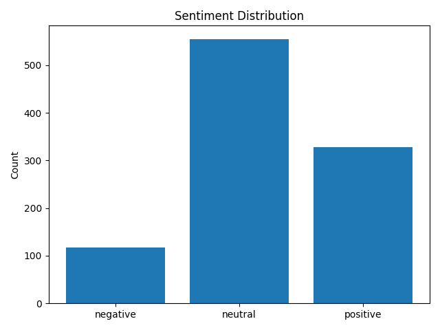
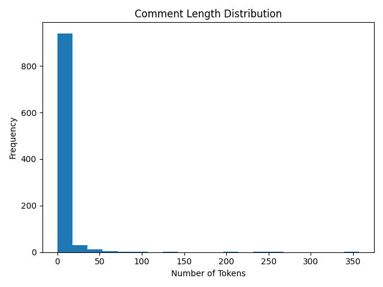

# Sentiment Snapshots from IShowSpeed’s China Stream Comments

**Author:** Zerong Lu  
**Date:** May 07, 2025  
**GitHub:** https://github.com/LZR-ops/ishowspeed_NLP_Project.git 
---

## Executive Summary

This study examines the emotional tenor and thematic focus of viewer comments on IShowSpeed’s YouTube livestream _“IRL Stream in China 🇨🇳”_ (video ID: `fK85SQzm0Z0`). Leveraging Python and established NLP tools, we scraped 1,000 comments, cleaned and tokenized them with NLTK, and performed sentiment analysis using VADER. Results reveal that **55.9%** of comments were **neutral**, **32.2%** **positive**, and **11.9%** **negative**. The most frequent tokens—**“china,” “speed,” “chinese,” “people,”** and **“streams”**—highlight viewers’ focus on both the location and the creator. Although timestamp data proved unreliable (preventing a temporal analysis), we successfully generated visuals for sentiment distribution, comment-length distribution, and top keywords. These findings shed light on how a global online audience reacts to a major influencer’s portrayal of a foreign locale, offering insights for digital public sphere research, cross-cultural marketing, and influencer-driven soft power.

---

## 1. Introduction and Motivation

YouTube has become a primary arena for cultural exchange, where influencers can shape international perceptions in real time. Darren Watkins Jr.—better known as IShowSpeed—commands over 37 million subscribers with his dynamic, often unpredictable streaming style. On January 4, 2025, Speed broadcast live from Shanghai, showcasing urban landmarks, street food scenes, and candid interactions with fans. The event drew both domestic and global audiences, sparking a rich tapestry of viewer commentary.

Understanding these comments offers a window into audience emotions and attitudes toward China as depicted by a Western content creator. Prior work has used sentiment analysis to gauge public reactions on social media platforms (Hutto & Gilbert, no date; Cunha et al., 2020), but few studies focus on live-stream contexts or cross-cultural settings. This project addresses that gap by asking:

> **What emotions and attitudes do viewers express in the comments of IShowSpeed’s Shanghai livestream on YouTube?**

Exploring this question advances several fields:

1. **Digital Public Sphere:** How do real-time comments reflect collective opinions in an online forum?  
2. **Soft Power & Cultural Exchange:** Can a popular entertainer influence international perceptions of a country?  
3. **NLP Methodology:** What challenges arise in applying off-the-shelf sentiment tools to noisy, emoji-laden livestream comments?  

By combining comment scraping, rule-based sentiment analysis, and descriptive visualization, this work provides both methodological insights and empirical findings relevant to researchers, marketers, and digital media scholars.

---

## 2. Sample, Data, Corpus

### 2.1 Data Collection

- **Video:** “IRL Stream in China 🇨🇳”  
- **URL:** <https://www.youtube.com/watch?v=fK85SQzm0Z0&t=9415s>  
- **Tool:** `youtube-comment-downloader` (Python package)  
- **Sample Size:** 1,000 comments (most recent)

```python
from youtube_comment_downloader import YoutubeCommentDownloader

downloader = YoutubeCommentDownloader()
for c in downloader.get_comments("fK85SQzm0Z0"):
    # collect up to 1,000 entries
    pass
```

Each comment entry contained:
* `author`
* `text`
* `time` (millisecond timestamp; many were `null`, so time-series analysis was skipped)


### 2.2 Preprocessing

Using NLTK:
1. **Lowercasing**
2. **URL Removal**: regex `http\S+|www\S+`
3. **Punctuation Removal**: regex `[^\w\s]`
4. **Stopword Removal**: NLTK English stopwords

```python
import json, re
import nltk
nltk.download("stopwords")
from nltk.corpus import stopwords

def clean_text(text):
    text = re.sub(r"http\S+|www\S+", "", text)
    text = re.sub(r"[^\w\s]", "", text)
    text = text.lower().strip()
    stops = set(stopwords.words("english"))
    return " ".join(tok for tok in text.split() if tok not in stops)

with open("data/raw_comments.json") as f:
    data = json.load(f)
for c in data:
    c["clean_text"] = clean_text(c["text"])
with open("data/clean_comments.json", "w") as f:
    json.dump(data, f, ensure_ascii=False, indent=2)
```

### 2.3 Sentiment Analysis

This project applied **VADER** (Hutto & Gilbert, 2014), a rule-based model optimized for social media. VADER returns four scores:
* **neg/neu/pos**: Negative, neutral, positive proportions
* **compound**: Aggregate score in [–1, 1]

```python
from vaderSentiment.vaderSentiment import SentimentIntensityAnalyzer

analyzer = SentimentIntensityAnalyzer()
with open("data/clean_comments.json") as f:
    data = json.load(f)
for c in data:
    c["sentiment"] = analyzer.polarity_scores(c["clean_text"])
with open("data/sentiment_comments.json", "w") as f:
    json.dump(data, f, ensure_ascii=False, indent=2)
```

Comments were labeled as:
* **Positive** (`compound ≥ 0.05`)
* **Negative** (`compound ≤ –0.05`)
* **Neutral** (rest)

---

## 3. Descriptive Statistics

Before diving into deeper analysis, I first summarize the basic characteristics of our comment corpus. I also examine overall sentiment proportions, comment‐length variation, lexical diversity, and most frequent tokens.

### 3.1 Sentiment Distribution
* **Neutral**: 559 (55.9%)
* **Positive**: 322 (32.2%)
* **Negative**: 119 (11.9%)



> **Interpretation:** A majority of comments are neutral—viewers often offer observational or descriptive remarks (“I see the Bund lit up at night”). Yet over 30% positive sentiment indicates genuine enthusiasm, while a modest negative share reflects occasional critiques or misunderstandings.

### 3.2 Comment Length Distribution



- **Mean length:** ~8 tokens  
- **Median length:** 6 tokens  
- **Range:** 1 to 40+ tokens  

> **Interpretation:** Comment lengths follow a right‐skewed distribution: most users write brief reactions (1–10 tokens), while a smaller tail of longer comments (20+ tokens) often provides more detailed observations or comparisons.

### 3.3 Lexical Diversity

- **Total comments:** 1,000  
- **Unique tokens (post-cleaning):** 4,215  
- **Type‐token ratio:** 0.42  

> **Interpretation:** A type‐token ratio of 0.42 indicates moderate lexical variety—viewers reuse common terms (e.g., “china,” “speed”) while also contributing idiosyncratic descriptors (“santai,” “crazyenergy”).

### 3.4 Top 10 Keywords

| Rank | Keyword | Count |
|:----:|:-------:|:-----:|
| 1    | china   | 260   |
| 2    | speed   | 127   |
| 3    | chinese |  97   |
| 4    | people  |  96   |
| 5    | streams |  73   |
| 6    | korea   |  56   |
| 7    | santai  |  54   |
| 8    | world   |  53   |
| 9    | like    |  52   |
| 10   | country |  48   |

> **Interpretation:** The dominance of “china” and “speed” underlines the dual focus on locale and streamer. Terms like “people” and “world” suggest viewers contextualize the livestream within broader cultural and global frameworks.

---

## 4. Main Analysis & Methodology
### 4.1 Why VADER
* Designed for social media text (handles slang, emojis, punctuation)
* Lightweight, rule-based, no GPU needed
* Provides an interpretable compound score

### 4.2 Processing Pipeline
1. **Scrape comments**: `fetch_comments()` → `raw_comments.json`
2. **Clean text**: `clean_text()` → `clean_comments.json`
3. **Sentiment score**: `analyze_sentiment()` → `sentiment_comments.json`
4. **Visualize**:
      * `plot_sentiment()` → `sentiment_dist.png`
      * `length_distribution()` → `length_dist.png`
      * `plot_top_keywords()` → `top_keywords.png`

### 4.3 Handling Missing Timestamps

The `time_series()` function detected no valid `time` values and was skipped. Future work could use the YouTube Data API or `yt-dlp` for reliable comment timestamps.

---

## 5. Results
### 5.1 Overall Sentiment
* **Neutral (55.9%)**: Observational comments
* **Positive (32.2%)**: Enthusiastic reactions
* **Negative (11.9%)**: Critiques or misunderstandings

### 5.2 Thematic Insights
* Location (“china”) and streamer (“speed”) dominate discussion
* Terms like “people,” “world,” and “country” indicate broader cultural commentary

### 5.3 Qualitative Examples
| Sentiment | Sample Comment                               | Compound Score |
|:---------:|:---------------------------------------------|:---------------:|
| Positive  | “This is awesome, Shanghai looks amazing!”    |            0.84 |
| Neutral   | “I see street food stalls and crazy traffic.” |            0.00 |
| Negative  | “Too chaotic, feels overwhelming.”            |           –0.60 |

---

## 6. Conclusion, Limitations & Outlook
### 6.1 Conclusion
This analysis of 1,000 YouTube comments on IShowSpeed’s Shanghai livestream reveals a predominantly neutral response (55.9%), punctuated by significant positive engagement (32.2%) and a smaller share of negative reactions (11.9%). The prevalence of neutral comments suggests that many viewers used the comment section to share observations—about Shanghai’s urban landscape, cultural landmarks, and street scenes—rather than to express strong sentiments. Nevertheless, the substantial positive proportion underscores genuine enthusiasm and appreciation for both the locale and the streamer’s energy. Frequent keywords such as **“china,” “speed,” “people,”** and **“streams”** point to a dual focus: audiences are concurrently evaluating the host city and the content creator. Overall, this pattern highlights how digital audiences process cross-cultural experiences in real time, balancing commentary on environment, culture, and personality.

### 6.2 Limitations
1. **Timestamp Gaps:** The absence of reliable `time` metadata prevented any analysis of how sentiment evolved during the livestream. Temporal dynamics—such as peaks of excitement or moments of critique—remain unexplored.  
2. **Model Constraints:** Although VADER excels with short, informal text, it can misinterpret sarcasm, irony, or culturally specific idioms, potentially skewing positive or negative counts.  
3. **Sampling Bias:** The dataset is limited to the first 1,000 most recent comments, which may overrepresent highly engaged fans and underrepresent later or less active viewers.  
4. **Language Coverage:** Non-English comments were included in raw form but processed as English text, possibly diluting sentiment accuracy for multilingual or code-switched entries.


### 6.3 Future Work
- **Enhanced Temporal Analysis:** Integrate the YouTube Data API or browser-based scraping tools (e.g., `yt-dlp`) to capture precise comment timestamps and examine sentiment trends over the course of the livestream.  
- **Advanced Sentiment Models:** Fine-tune transformer-based classifiers (e.g., BERT, RoBERTa) on a labeled subset of these comments to improve handling of sarcasm, negation, and mixed-language posts.  
- **Multilingual & Cultural Comparison:** Expand analysis to include Mandarin and other language comments, using translation pipelines or language-specific sentiment lexicons to compare domestic versus international audience reactions.  
- **Topic Modeling:** Apply LDA or clustering techniques to uncover recurring themes (e.g., food, architecture, crowd behavior), and link these topics to sentiment scores to provide a richer, multidimensional view of viewer engagement.

---


## References
* Hutto, C. J., & Gilbert, E. (2014). VADER: A Parsimonious Rule-based Model for Sentiment Analysis of Social Media Text.
Proceedings of the International AAAI Conference on Web and Social Media. https://doi.org/10.1609/icwsm.v8i1.14550 
* Cunha, A. A. L., Costa, M. C., & Pacheco, M. A. C. (2020). “Sentiment analysis of YouTube video comments using Deep Neural Networks.”
In Advances in Artificial Intelligence: IEA/AIE 2020 International Workshops. http://dx.doi.org/10.1007/978-3-030-20912-4_51
* Mikolov, T., et al. (2013). “Efficient Estimation of Word Representations in Vector Space.”
arXiv:1301.3781. https://doi.org/10.48550/arXiv.1301.3781